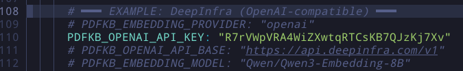

# Practical Use Case: PDF Knowledge Base

## Overview

Many students struggle with studying from messy and scrambled PDF files. This MCP server helps you index your local PDF or Markdown files to extend the context of your AI agent, enabling useful actions such as:

- Asking questions about your documents
- Generating summaries
- Getting study suggestions directly from your PDFs

---

## Prerequisites

- **Python** 3.11 or higher
- **Docker** installed and running
- A valid API key (DeepInfra or compatible service)

---

## Platform-Specific Setup

### Linux

#### Installation

1. Ensure Docker is installed:
```bash
sudo apt install -y docker.io docker-compose
sudo systemctl start docker
sudo usermod -aG docker $USER
```

2. Verify installation:
```bash
docker --version
docker-compose --version
```

### Windows

#### Installation

1. Download and install **Docker Desktop** from [docker.com/products/docker-desktop](https://www.docker.com/products/docker-desktop)
2. Run the installer and follow the on-screen instructions
3. Restart your computer when prompted
4. Open PowerShell or Command Prompt and verify:
```cmd
docker --version
docker-compose --version
```

---

## PDFKB MCP Server (Docker)

### Step 1: Create the Working Directory

Create a dedicated working directory for the PDFKB server.


**Linux/Windows(PowerShell):**
```bash
mkdir pdfkb
cd pdfkb
```


---

### Step 2: Download Docker Compose Configuration

Download the sample Docker Compose file and create required folders.

**Linux & Windows (Command Prompt / PowerShell):**
```bash
curl -o docker-compose.yml https://raw.githubusercontent.com/juanqui/pdfkb-mcp/main/docker-compose.sample.yml
mkdir -p documents cache logs
```

**What each folder does:**
- `documents/` — Store your PDF or Markdown files here
- `cache/` — Embeddings and model artifacts (auto-generated)
- `logs/` — Server logs (auto-generated)

---

### Step 3: Edit `docker-compose.yml`

Open the `docker-compose.yml` file in your text editor and update the following values.

#### Document directory path

Find the volumes section and update the path to your documents folder:

**Example:**


> Use the full absolute path to your folders. On Windows, use double backslashes (`\\`) or forward slashes (`/`).

#### API Key Configuration

Find the environment variables section and add your API key:



Replace `PDFKB_OPENAI_API_KEY: "your-deepinfra-api-key-here"` with your actual API key.

---

### Step 4: Start the Server

Navigate to your pdfkb directory and start the Docker container.

**Linux & Windows (Command Prompt / PowerShell):**
```bash
docker compose up
```

> ⚠️ **First Run Warning:**
> The embedding/inference model will be downloaded on first run (~1 GB).
> Ensure you have sufficient disk space and a stable internet connection.
> This process may take several minutes.

Once running, the PDFKB MCP server will automatically index documents in the `documents/` folder.

---

### Step 5: Add Documents

1. Place your PDF or Markdown files in the `documents/` folder
2. Access the web interface at `http://localhost:8000`
3. Upload files directly or copy them to the `documents/` folder
4. The server will automatically index them


> ⚠️ **Note:**
> Indexing time depends on file size and your machine's specs. Large PDFs may take several minutes.

---

## Using the Knowledge Base

Once the server is running and documents are indexed, interaction happens primarily through the **`search_documents`** tool. Below are practical MCP-aligned usage patterns.

---

### Use Case 1: Semantic Citation & Evidence Retrieval

Find where specific ideas or concepts are discussed in your documents.

**What to analyze:**
- Document locations and page numbers
- Relevant quoted passages
- Citations and references

**Prompt to try:**
> "Use search_documents to find discussions related to 'non-linear neural plasticity'. For the top results: extract the most relevant quoted passage, include the source PDF filename, include the page number or section if available, and note any citations to other authors or papers."

---

### Use Case 2: Structured Data & Table Extraction

Extract and compare numerical data, metrics, and results from your documents.

**What to analyze:**
- Numerical results and metrics
- Experimental data across multiple sources
- Comparative values and statistics

**Prompt to try:**
> "Search documents for experimental results reporting 'mean accuracy' and 'standard deviation'. From the most relevant results: extract numerical values from tables, associate each value with its source document, present the data as a consolidated Markdown table, and sort entries by publication year if mentioned."

---

### Use Case 3: Study Preparation

Create active study material for exams, defenses, or thesis preparation.

**What to prepare:**
- Main contributions and methodology
- Key concepts and assumptions
- Active recall questions

**Prompt to try:**
> "Search for the most relevant chunks from 'Filename.pdf' related to its methodology and core contribution. Based on the retrieved content: summarize the paper's main contribution, explain the methodology in simple terms, and generate 5 challenging active-recall questions specifically focused on the methods and assumptions."


