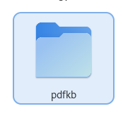
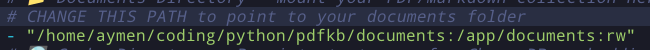
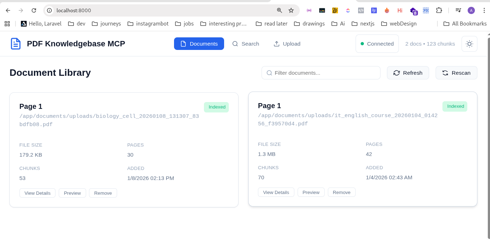

# MCP Server Demo Setup with Claude

This guide will help you set up and run the **Claude MCP server demo** using `uv` and the MCP CLI.

---

## Prerequisites

- Python 3.11+ installed
- `uv` package installed (`pip install uv`)
- MCP package installed with CLI support (`pip install mcp[cli]`)
- Your `main.py` server file ready  
  (example path: `C:\Users\DELL\Documents\mcpserver\main.py`)

---

## Configuration

Here’s an example configuration to run the MCP server with Claude:

```json
{
  "mcpServers": {
    "mcp-server-demo": {
      "command": "uv",
      "args": [
        "run",
        "--with",
        "mcp[cli]",
        "mcp",
        "run",
        "C:\\Users\\DELL\\Documents\\mcpserver\\main.py"
      ]
    }
  }
}
```

---

# Practical Use Case: PDF Knowledge Base

### Overview

Many students struggle with studying from messy and scrambled PDF files. This MCP server helps you index your local PDF (or Markdown) files to extend the context of your AI agent, enabling useful actions such as:

- Asking questions about your documents
- Generating summaries
- Getting study suggestions directly from your PDFs

---

### Prerequisites (PDF KB)

- Python 3.11+ installed
- Docker installed

---

## PDFKB MCP Server (Docker)

### 1. Create the Working Directory and Configuration

First, create a dedicated working directory and move into it:



```bash
mkdir pdfkb
cd pdfkb
```

---

### 2. Download Docker Compose Configuration

Download the sample Docker Compose file from the repository and create the required folders:

```bash
curl -o docker-compose.yml https://raw.githubusercontent.com/juanqui/pdfkb-mcp/main/docker-compose.sample.yml
mkdir -p ./documents ./cache ./logs
```

- `documents/` → PDF or Markdown files
- `cache/` → embeddings and model artifacts
- `logs/` → server logs

---

### 3. Edit `docker-compose.yml`

Open `docker-compose.yml` and update the following values.

#### Volume Mapping

```yaml
- "/path/to/your/documents:/app/documents:rw"
```

Example:



This directory will hold your Docker configuration, documents, cache, and logs.

#### API Key

```yaml
PDFKB_OPENAI_API_KEY: "your-deepinfra-api-key-here"
```


---

### 4. Start the Server

```bash
docker compose up
```

> ⚠️ **Important:**  
> On first run, the embedding / inference model will be downloaded.  
> This download can be **large (around ~1 GB)**, so make sure you have enough disk space and a stable internet connection.

Once running, the PDFKB MCP server will automatically index the documents inside the `documents/` folder and make them available to your AI agent through MCP.

---

### 5. Adding Documents

- Access the web interface at `http://localhost:8000`
- Upload the PDF files you want to index (make the AI model aware of them)



> ⚠️ **Important:**  
> Indexing large PDF files may take time and depends on your machine’s specs.

---
## 6. Using the Knowledge Base (MCP-Aligned)

Once the server is running and documents are indexed, interaction with the knowledge base should primarily happen through the **`search_documents`** tool.  


Below are practical, MCP-aligned usage patterns and example prompts.

---

### Use Case 1: Semantic Citation & Evidence Retrieval

This use case relies on **`search_documents`** to perform hybrid semantic + keyword search across all indexed PDFs.

**When to use:**
- Locating where an idea is discussed
- Finding evidence, quotes, or supporting material
- Tracing concepts across multiple documents

**Prompt:**

```
Use search_documents to find discussions related to
"non-linear neural plasticity".

For the top results:
- Extract the most relevant quoted passage
- Include the source PDF filename
- Include the page number or section if available
- If the text references another author or paper, note that citation
```

---

### Use Case 2: Structured Data & Table Extraction

This use case leverages the fact that documents are **chunked and parsed**, making tables more accessible than in raw PDF viewers.

**When to use:**
- Extracting metrics across papers
- Comparing reported results

**Prompt:**

```
Search documents related to experimental results reporting
"mean accuracy" and "standard deviation".

From the most relevant results:
- Extract numerical values from tables where available
- Associate each value with its source document
- Present the data as a consolidated Markdown table
- Sort entries by publication year if mentioned
```

---

### Use Case 3: Study Preparation

Creates **active study material** instead of generic summaries.

**When to use:**
- Exam preparation
- Thesis or defense prep

**Prompt:**

```
Search for the most relevant chunks from "Filename.pdf"
related to its methodology and core contribution.

Based on the retrieved content:
- Summarize the paper’s main contribution
- Explain the methodology in simple terms
- Generate 5 challenging active-recall questions
  specifically focused on the methods and assumptions
```

---

